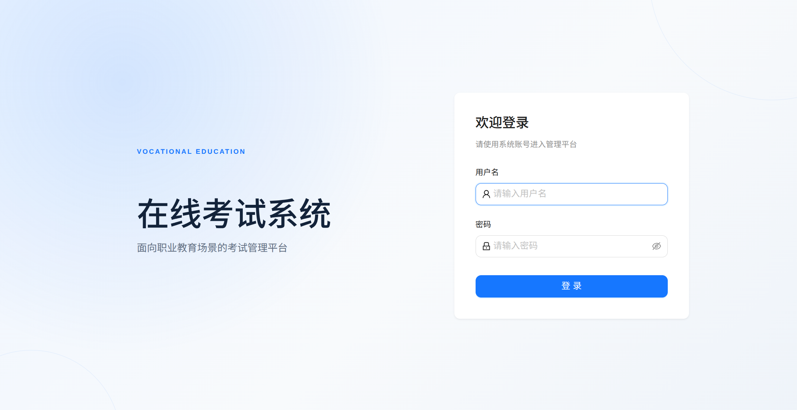
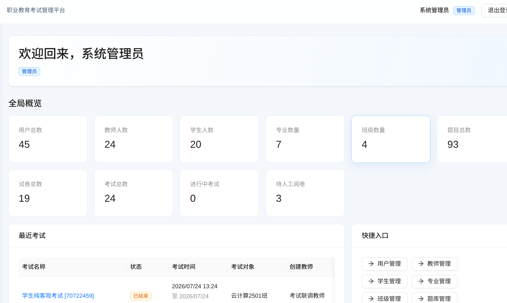
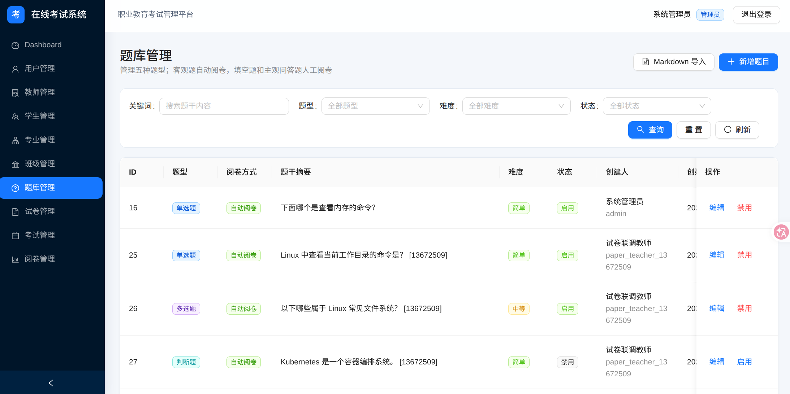
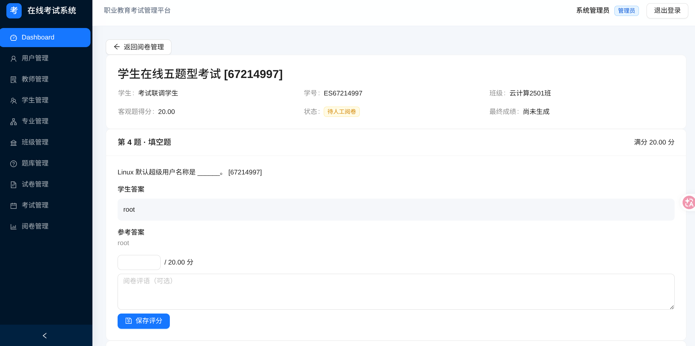

# 在线考试系统 V1.0

面向职业教育场景的在线考试系统，覆盖组织与账号管理、五种题型题库、Markdown 批量
导题、人工组卷、考试发布快照、学生在线作答、自动保存、客观题自动评分、人工题阅卷
和最终成绩查询。

## 项目截图

| 登录页面 | 管理员 Dashboard |
| --- | --- |
|  |  |

| 题库管理 | 人工阅卷 |
| --- | --- |
|  |  |

## 技术栈

- Backend：Python 3.12、FastAPI、SQLAlchemy 2.x、Pydantic v2、Alembic
- Database：MySQL 8.4、utf8mb4
- Frontend：React 18、TypeScript、Vite、Ant Design、React Router、Axios、Zustand
- Security：JWT、Argon2、RBAC（admin / teacher / student）
- Deployment：Docker Compose、Nginx

## 核心功能

- 专业、班级、教师、学生与用户状态管理
- 单选、多选、判断、填空、主观问答五种题型
- 固定格式 Markdown 粘贴/文件上传、逐题预览与合法题批量导入
- 试卷人工组卷、分值、顺序、总分和生命周期
- all / major / class 考试对象与不可变 ExamQuestion Snapshot
- 学生开始考试、唯一 Attempt、deadline、五题型作答、自动保存与刷新恢复
- 主动/超时交卷，三种客观题自动评分，两种人工题教师阅卷
- 学生个人成绩、教师考试成绩与权限隔离

## 生产式快速启动

只需要 Docker Engine 和 Docker Compose v2，不依赖宿主机 Python、Node、MySQL、
`.venv` 或 `node_modules`。

```bash
cp .env.example .env
```

修改 `.env` 中所有 `CHANGE_ME` 值后执行：

```bash
docker compose config
docker compose up -d --build --wait
docker compose ps
```

访问 `http://localhost/`（若设置 `APP_PORT=8080`，则访问 `http://localhost:8080/`）。
Frontend Nginx 是唯一浏览器入口，React 静态资源和 `/api` 均同源访问。Backend 启动
前等待 MySQL healthy，随后自动执行全部 Alembic Migration 和幂等 Seed。

停止但保留数据：

```bash
docker compose down
```

清空环境（会删除数据库卷，仅用于明确的测试场景）：

```bash
docker compose down -v
```

详细的首次部署、升级、日志、Migration、Seed、备份与恢复步骤见
[部署与运维文档](docs/04-deployment.md)。

## 项目结构

```text
backend/              FastAPI、领域 Service、ORM、Alembic 与测试
frontend/             React 应用、Nginx 配置、浏览器 E2E 与单元测试
docs/                 需求、数据库、Markdown 导入、部署与验收文档
scripts/              MySQL 备份/恢复脚本
docker-compose.yml    mysql + backend + frontend
.env.example          无真实凭证的部署变量模板
```

## 开发与验证

Backend：

```bash
cd backend
python3.12 -m venv .venv
source .venv/bin/activate
pip install -e ".[dev]"
ruff check app tests alembic/env.py
pytest -q
alembic check
```

Frontend：

```bash
cd frontend
npm ci
npm run lint
npm run test
npm run build
npm run dev
```

Vite 开发服务器将相对 `/api` 代理到 `http://localhost:8000`；生产构建不硬编码
`localhost:8000`。

## 安全提示

- 不要提交 `.env`、SQL 备份或真实账号密码。
- 生产启动拒绝示例 JWT Secret 和管理员密码，数据库业务连接使用非 root 用户。
- 学生考试 API 使用独立安全 Schema，不返回 `correct_answer`、`reference_answer`
  或 `analysis`。
- Markdown 当前按纯文本展示，不使用 `dangerouslySetInnerHTML` 执行用户 HTML。
- Docker volume 不是备份；使用 `scripts/backup-db.sh` 并将备份复制到外部存储。

## 文档

- [需求文档](docs/01-requirements.md)
- [数据库设计](docs/02-database-design.md)
- [Markdown 题库导入规范](docs/03-markdown-question-import.md)
- [部署与运维](docs/04-deployment.md)
- [V1.1 候选路线](docs/05-v1.1-roadmap.md)

最终发布验收结果记录在 `docs/06-v1-acceptance-report.md`。
